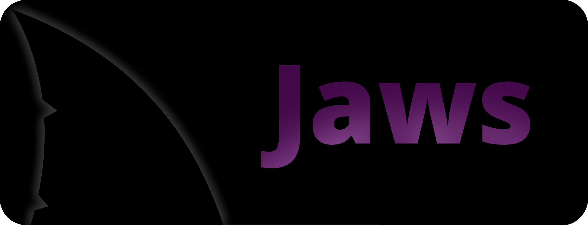

Jaws is an invisible interpreted programming language that was created for antivirus research. Since Jaws code is composed entirely of whitespace characters, it can easily coexist with other programming languages to create [polyglot code](https://en.wikipedia.org/wiki/Polyglot_(computing)).

The research behind Jaws aims to build awareness that unknown interpreters can be dangerous. Behavior based detection is becoming the gold standard -- even AI-based static models can only detect the types of threats they've been trained on. You could add signatures for Jaws, but nothing is stopping an advanced attacker from reproducing their own version of this in a different way. When the "code" of the malware is completely unreadable but can execute anyways, it exploits a fundamental flaw in the foundation of static analysis tools. To read more about Jaws and why it was created, please refer to [my blog post](https://www.palehat.net/jaws-research/) or [my undergrad honors thesis](https://scholarworks.uni.edu/cgi/viewcontent.cgi?article=1423&context=hpt).

Tools for developing Jaws programs can be found in the various directories of this repository.

## Install

You can install all the programs by running the following command in the top level directory:

`$ make && make install`		<-- (you will be prompted for your sudo password)

## Tools

### jaws

***Jaws virtual machine***

Jaws is an interpreted language, so a virtual machine has been created to run Jaws programs. The virtual machine source code and language specification for Jaws can be found in the [jawsVM](jawsVM/) directory.

### finc 

***Fin-to-Jaws compiler***

Because Jaws instructions are entirely composed of invisible characters, a visible version of Jaws, called Fin, has been created. Fin allows you to write Jaws programs in a visible, human-debuggable fashion. Once you have written a Fin program, you can compile it to Jaws using the 'finc' compiler. The compiler source code and language specification for Fin can be found in the [finCompiler](finCompiler/) directory.

## Roadmap

### LLVM Target

***Jaws backend***

Eventually, I'd like to get Jaws to the point where it can be used as an LLVM backend target with the intention of being able to compile C to Jaws. That would make Jaws development a breeze.

### Code Injection

***Jaws injector***

I want to create a tool that can take Jaws code and inject it into many different file types including:
- non-whitespace controlled file formats
  - C, Java, etc.
  - markup files
  - text files
- whitespace controlled file formats
  - Python, etc.
- image files
  - JPG, PNG, GIF, etc.
